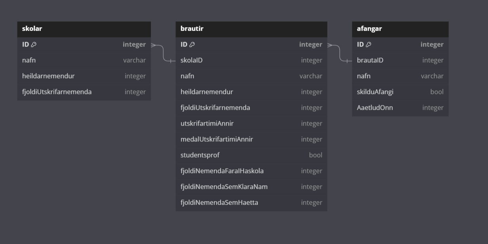

# DATABASE

---

Designing a database is a critical step in building any data-driven application. A well-designed database ensures data integrity, efficiency, and scalability. Here's a step-by-step tutorial on how to design a database:

1. Define the Purpose and Requirements:

- Understand the purpose of your database. What problem does it solve?
List the data requirements, including what data needs to be stored, retrieved, and how it will be used.

  - The purpose of the database is to hold information about different schools all in one place. It will take data from "Menntamálastofnunin", "HÍ" and "HR". It will store the following:
    - skólanafn
    - kynjahlutföll skóla
      - heildarnemendur
      - karlsnemendur
      - kvennemendur
    - prósenta sem fara í háskóla
      - heildarnemendur
      - margir í HR/HÍ úr X Skóla
    - Prósenta sem klára skóla (dropout rate)
      - heildarnemendur
      - útskriftarnemendur
    - Meðal útskriftartími
      - heildar útskrifartími alla nemanda
      - heildarnemendur
    - Hversu margir sækja um skólann
    - Hversu margir komast inn í skólann (%)
      - Samþykktar umsóknir nýnema eftir skóla og kyni
    - Hversu margir ná fyrsta/seinna val
    - Áfangar á braut
    - Braut í skóla
    
2. Identify Entities and Attributes:

- Identify the main entities (objects) in your database. These are often nouns like "Customer," "Product," or "Order."
For each entity, list its attributes (fields) and their data types. For example, a "Customer" entity might have attributes like "Name," "Email," and "Address."

  - Skóli
    - heildarnemendur
      - konur
      - karlar
    - Brautir
    - fjöldi útskrifanemenda
    - fyrstaval karla
    - fyrstaval kvenna
    - annadval karla
    - annadval kvenna
    - sammþykktar konur (int)
    - samþykktir karlar (int)
    - Fengu fyrsta val
    - Fengu annað val

  - Brautir
    - Heildarnemendur
    - kynjahlutföll
    - Meðalútskrifartími
    - Áætlaður útskrifartími
    - Stúdentspróf
    - Útskrifarprósenta
    - hversu margir komast/fara í háskóla
    - Hversu margir klára námið

  - Áfangar
    - Nafn áfanga
    - skilduáfangi
    - áætluð önn

  - Landshlutar
    - Landshluti(höfupborgarsvæði)
    - almennt bóknám int
    - starfsbraut int
    - starfsnám int
    - undirbúningsnám int
    - hafnad
    - samþykkt
    - onnurLok

  - Námsleið
    - Nafn(almennt bóknám)
    - karl
    - kona
    - kyn ekki skráð, kynsegin
    - hafnað
    - samþykkt
    - önnur lok

  - Aldursbil
    - 17-18 hafnað
    - 17-18 samþykkt
    - 17-18 önnurlok
    - 19-24 hafnað
    - 19-24 samþykkt
    - 19-24 önnurlok
    - 25+ hafnað
    - 25+ samþykkt
    - 25+ önnurlok
    - nýnemi hafnað
    - nýnemi samþykkt
    - nýnemi önnurlok

3. Create an Entity-Relationship Diagram (ERD):

- Visualize the relationships between entities using an ERD. Common relationships include one-to-one, one-to-many, and many-to-many.
Use tools like draw.io, Lucidchart, or ERD software to create the diagram.

3. Normalize Your Data:

- Apply the principles of database normalization to reduce data redundancy and improve data integrity. Common normal forms include 1NF, 2NF, and 3NF.

4. Define Primary Keys:

- Choose a primary key for each entity. It should be a unique identifier for that entity.
You can use a single field (e.g., a Customer ID) or a composite key (multiple fields).

5. Define Relationships:

- Establish relationships between entities using foreign keys. A foreign key in one table refers to the primary key in another table.
Determine the cardinality of each relationship (one-to-one, one-to-many, or many-to-many).

6. Set Up Indexes:

- Identify fields that are frequently used in search and retrieval operations. These fields should have indexes for faster query performance.

7. Create Tables:

- Using your ERD, create the actual database tables in your database management system (e.g., SQL, NoSQL).
Define data types, constraints, and relationships in your SQL scripts or database modeling tool.

8. Implement Data Integrity Rules:

- Enforce data integrity using constraints like UNIQUE, NOT NULL, and CHECK constraints.
Use triggers and stored procedures to implement custom business rules.

9. Populate Data:

- Insert initial data into your tables. This can be done manually, through data import, or through your application.

10. Test Your Database:

- Perform extensive testing to ensure data integrity and reliability.
Test CRUD operations (Create, Read, Update, Delete) and edge cases.

11. Optimize Performance:

- Continuously monitor and optimize your database for performance. This may involve indexing, query optimization, and schema adjustments.

12. Document Your Database:

- Create documentation that describes the schema, relationships, and any business rules.

13. Back Up and Secure:

- Regularly back up your database and implement security measures to protect your data.

14. Maintain and Evolve:

- As your application evolves, the database design may need to change. Regularly review and update your database design to accommodate new requirements.
Remember that database design is an iterative process. It's essential to involve stakeholders and users throughout the design process to ensure that the database meets their needs. Additionally, consider the scalability and future expansion of your database as your application grows.
